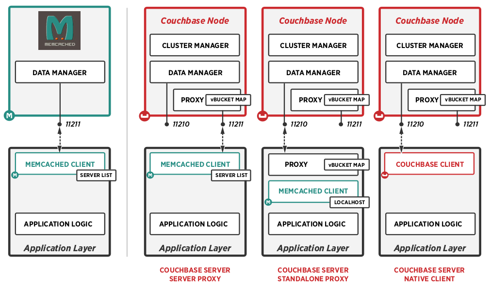

memccache – a fast compiler cache
=================================

_(ccache with memcached support)_

Originally from PR [#30](https://github.com/ccache/ccache/pull/30) and PR [#58](https://github.com/ccache/ccache/pull/58)

ccache is a compiler cache. It speeds up recompilation by caching the result of
previous compilations and detecting when the same compilation is being done
again. Supported languages are C, C++, Objective-C and Objective-C++.

memcached is a high-performance, distributed memory object caching system.
It can be complimented with `moxi` memcached proxy <https://github.com/couchbase/moxi>
and couchbase server <https://www.couchbase.com/server>.

Couchbase (optional)
--------------------

It is possible to use `moxi` memcached proxy and the Couchbase Server, 
by changing the memcached and the couchbase configuration of memccache.

See <https://couchbase.com/memcached-replacement> for the details:

Both moxi and couchbase are Open Source, and have a "community edition". 
Any other server compatible with memcached would also work for memccache.

* <https://docs.couchbase.com/server/6.0/install/ubuntu-debian-install.html>
* tested with `couchbase-server-community_6.0.0-1693-1_amd64.deb`

NOTE: 6.0 is the _final_ release with moxi, it is not included anymore in 6.5 
Newer versions of couchbase don't support memcached buckets, only JSON.

General information
-------------------

* [Main web site](https://ccache.dev)
* [Documentation](https://ccache.dev/documentation.html)
  * [Latest manual](https://ccache.dev/manual/latest.html)
  * [Installation from Git source repository](https://github.com/ccache/ccache/blob/master/doc/INSTALL.md)
  * [Installation from release archive](https://github.com/ccache/ccache/blob/master/doc/INSTALL-from-release-archive.md)
* [Release notes](https://ccache.dev/releasenotes.html)
* [Credits and history](https://ccache.dev/credits.html)
* [License and copyright](https://ccache.dev/license.html)

Contributing to ccache
----------------------

* [Source repository](https://github.com/ccache/ccache)
* [Notes on how to contribute](https://github.com/ccache/ccache/blob/master/CONTRIBUTING.md)
* [Mailing list](https://lists.samba.org/mailman/listinfo/ccache/)
* [Bug report info](https://ccache.dev/bugs.html)
* [Issue tracker](https://github.com/ccache/ccache/issues)
  * [Help wanted!](https://github.com/ccache/ccache/labels/help%20wanted)
  * [Good first issues!](https://github.com/ccache/ccache/labels/good%20first%20issue)
